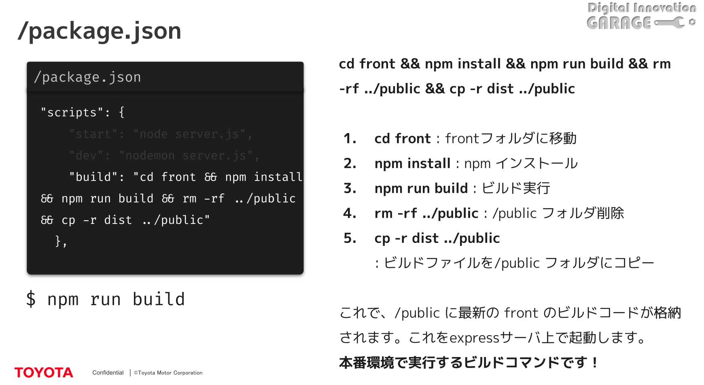
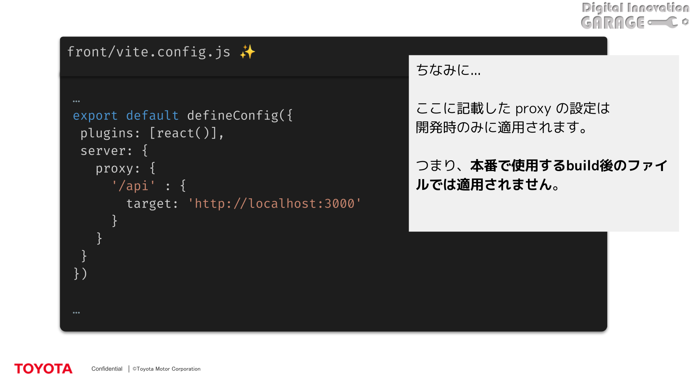

メモ帳

# 1.setup

<soloMVP>
npm create vite@latest
Prohject name :front
Select a framework:react
Select a variant:JacaScript
→ファイル、フォルダが完成

# 2.それぞれの意味

-node_modules　サードパーティのコードが含まれる

-public 画像ファイルのような静的コンテンツ

-src これから実装していくソースコードファイル

-dist/ ビルドファイルを格納する
作成方法[npm run build]
これで本番で使用する無駄のないコードを生成

-reactのコード(JSX)をトランスパイル&バンドルしている

-gitignore gitに無視させたいファイルやフォルダを指定
(情報が入っている.envや不要なnode_modulesなど)

-eslint.config.js eslintの設定ファイル
バグを生み出しづらいルールを設定して自動でチェックしてくれる

-index.html エントリーポイントのファイルApp.jsxより軸となる部分

-package.json プロジェクトの情報
dependency(アプリを動かすのに必要なモジュールが入った配列)
scripts(コマンドを簡略化してそれに伴う処理設定する)
devDependencys(開発で必要な@などの型が付いたもの,eslint系のもの)
追加方法
[npm install -D 入れたいもの]

-package-lock.json
(packge.json)より詳しいnpmを使った場合のdependencyのバージョン記録

# 3.サーバーの作成

<soloMVP>
npm init -y package.jsonを作ってくれる
npm install express
npm install -D nodemon
mkdir public
touch server.js ファイルがあったら触って日時を更新、なかったら作る
code .

sever.jsに
{--
const path = require("path");
const express = require("express");
const app = express();
const PORT = process.env.PORT || 3000;

app.use(express.static(path.join(\_\_dirname, "/public")));

app.listen(PORT, () => {
 console.log(`Server running on port ${PORT}`);
});}
--をコピペ

app.use(express.static(path.join(\_\_dirname, "/public")));
静的ファイル(css,js,画像など)の格納場所を定義
(例)GET /index.html → /public/index.htmlを返す
front/pagage.jsonを
"scripts": {
"dev": "vite", ホットリロードでreactが起動、サーバー立ち上げ
"build": "vite build",
"lint": "eslint .",
"preview": "vite preview"
},
に書き換える(すでにokなはず)

package.jsonを
"scripts": {
"start": "node server.js", //サーバーが起動される
"dev": "nodemon server.js",
"build": "cd front && npm install && npm run build && rm -rf ../public && cp -r dist ../public"
},
に書き換える

- [開発中に使うコマンド]

[front/ npm run dev]
[npm run dev]

- [本番環境で使うコマンド]

[npm run build]
[npm run start]
フロントのコードをビルドし、その後サーバを起動する。
これは、renderなどの本番環境でアプリを実行するときに使用する

今の構成

環境変数の使用
console.log(proccess.env.USER) //VICSIDEOUS
アプリが起動されると
const port = process.env.PORT || 3000;は環境変数を返すようになる

app.use("/api",(req,res)=>{
res.send("Hello, World");
});

- [フロントエンドからエンドポイントを呼び出すにはどうしたらいいか]
  アドレスをハードコーディングしてはダメ
  ❌fetch('http://localhost:3000/api')
  アドレスが動的に変更されるように定義するべき
  ⭕️fetch('proccess.env.PORT/api')
  ⭕️fetch('my-app.onrender.com/api')
  [相対ぱすで呼び出しましょう]
  fetch('/api')
  [Production環境はこれでOK]
  fetch('/api')
  /apiにアクセスしたら
  lacalhost:5173/apiじゃなくて
  lacalhost:3000/apiを読んでねとサーバーに伝える必要がある。
  そのため、proxyの設定を行う必要がある
  
  これで期待通りのエンドポイントで呼び出すことができる

[自分のペット]
[ペットの追加]　/
