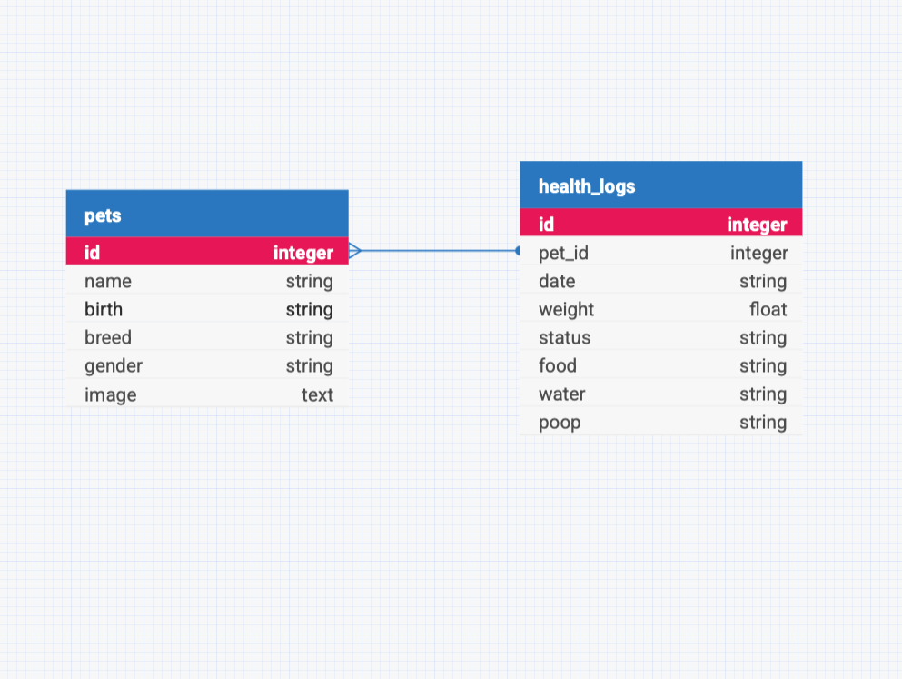

## アプリの目的

- ペットの健康を管理できるようにする
- グラフを用いることで視覚的に健康の異常に気がつくことができる
- 複数ペットのデータを一括管理する

## アプリのスキーマ

 となっています。

## 事前準備

依存関係のインストール
/soloMVPから

```sh
npm init -y
npm install
npm install express
npm install knex
npm install pg
npm install dotenv
npm install nodemon
```

/soloMVP/frontから

```sh
npm install
```

.env ファイルの作成(中身)

```
DB_USER=
DB_PASSWORD=
DB_NAME=soloMVP
```

マイグレーションとシード、リセットのコマンドは以下で実行できます。

```sh
npm run db:migrate
npm run db:seed
npm run db:reset
```

マイグレーションとシードが正常に実行されたら、データベースの確認をする

```sh
psql -d soloMVP
\dt
SELECT * FROM health_logs;
\q
```

## アプリの起動

/soloMVPから

```sh
npm run dev
```

/soloMVP/frontから

```sh
npm run dev
```

で立ち上げられます。

## 使用方法

- アプリを立ち上げ、アクセスする
- トップ画面でデフォルトでいるポチをクリック
- 情報がないためグラフはまだ空であることを確認する。
- 健康管理のボタンを押し、情報を入力する。
- 入力後自動でプロフィール画面に戻るのでグラフに情報が出ていることを確認する。
  (2つ以上情報を入れないとグラフは線にならないため注意が必要)

※グラフがうまく動かない場合はモジュールがうまくインストールされていない可能性があるので以下のコードを実行する必要があるかもしれない。

(グラフを作成してくれるモジュール)

/soloMVP/frontから

```sh
npm install cors
```

#### ペットの追加をしたい場合

- トップ画面下側の[ペットを追加]をクリック
- ペット情報入力フォームで情報を入力し登録を押す

  (登録後トップ画面への遷移機能は未実装のためコマンドでトップ画面に戻る必要がある)

## 未実装の機能

- 通院履歴の管理システムの実装
- ペット登録ボタンを押した時のtopページへの遷移
- 登録後のペット情報の編集
- 登録後のペットの削除機能(現状ではdb:resetでのみ削除可能)
- 日付(date)に応じたグラフの並べ替え

  (26日登録後に25日のデータを入れても26→25の順で表示されてしまう)

## 参考資料

- [Knex 公式ドキュメント](http://knexjs.org/)
- [挿入する画像に困ったら](https://dog.ceo/dog-api/)

## その他

seedのポチの画像は([DogAPI](https://dog.ceo/dog-api/))からとってきています。
